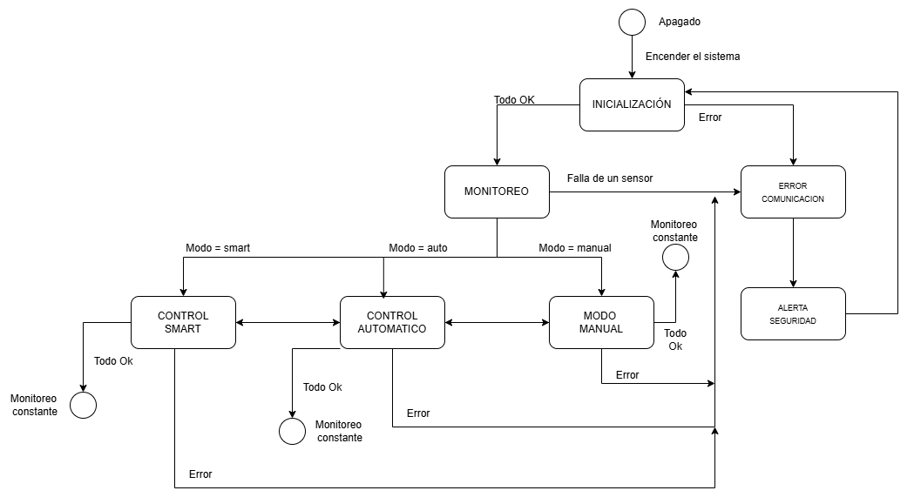
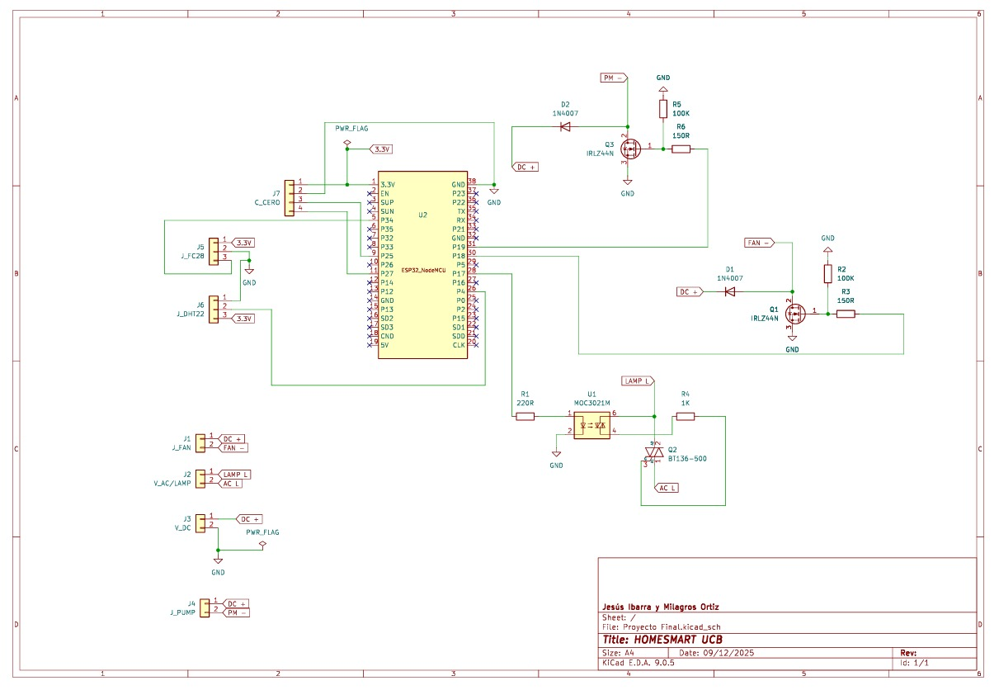
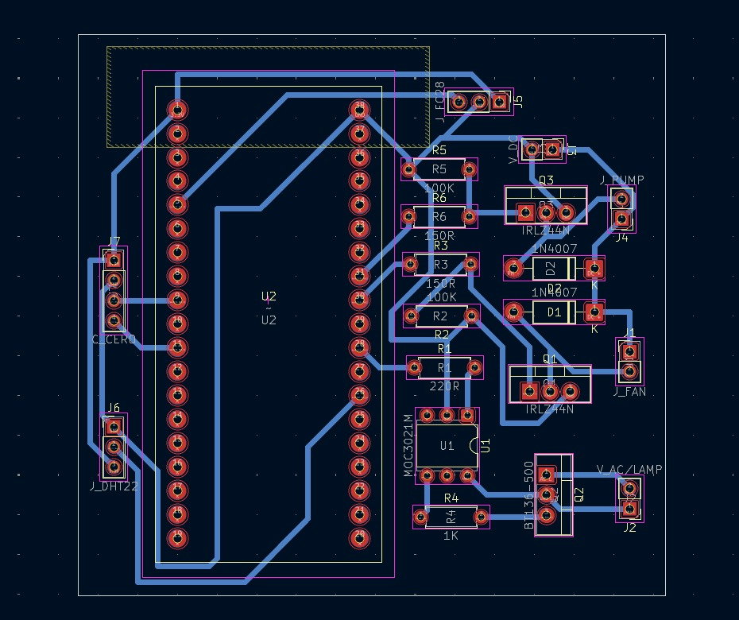

# 🏠 SmartHome UCB – Sistema Domótico Inteligente

## 📌 Descripción Breve
SmartHome UCB es un sistema domótico basado en ESP32 que automatiza procesos dentro de un hogar, integrando sensores ambientales, actuadores y un módulo de inteligencia artificial.  
Permite monitorear clima interior y exterior, controlar automáticamente ventilación y riego, recibir notificaciones y ejecutar acciones mediante comandos de voz.  
El proyecto está diseñado para ser accesible, escalable y adaptable
SmartHome UCB utiliza modelos de Machine Learning para:
- Predecir cuándo estás en casa
- Aprender tus hábitos diarios
- Analizar patrones climáticos
- Tomar decisiones autónomas
- Optimizar el uso de energía y agua
No es solo un sistema automático.
"Es un sistema que aprende contigo."

---

## 🧩 Diagramas del Sistema
Máquina de Estados Finitos:

---
##🪄Diseño de la PCB
Diagrama esquemático del circuito:

Ruteo de la PCB:

---

## 🛠 Tecnologías Utilizadas

### **Hardware**
- ESP32 (microcontrolador principal)
- Sensor BME280 (temperatura, humedad y presión exterior)
- Sensor DHT22 (temperatura y humedad interior)
- Sensor FC-28 (humedad del suelo)
- Relés / Triac con optoacopladores
- Ventilador (12V DC)
- Bomba de agua 12V
- Fuente de alimentación aislada

### **Software**
- **Python 3** (análisis + IA)
- **scikit-learn** (regresiones, clasificación, PCA)
- **pandas / numpy / matplotlib**
- **NLTK** (procesamiento de lenguaje natural)
- **Arduino IDE** (ESP32 firmware)
- **Mosquitto / MQTT**
- **KiCad**

---

## 👥 Integrantes y Roles

| Integrante | Rol |
|-----------|------|
| **Jesús Ibarra** | Diseño del sistema, MQTT, programación ESP32, documentación |
| **Milagros Ortiz** | Modelos ML, entrenamiento de google assistant, documentación |
---

## 📌 Estado Actual del Proyecto

### ✔ Avances logrados
- [x] Arquitectura general definida  
- [x] Integración básica de sensores  
- [x] Comunicación MQTT implementada  
- [x] Control inicial de ventilador y bomba  
- [x] Control de velocidad del ventilador 
- [x] Creación de dataset de prueba (CSV)  
- [x] Implementación de modelos (regresión y clasificación) como plantillas  
- [x] Diseño de FSM y diagramas  
- [x] Investigación de control por voz  
- [x] Módulo NLP preliminar  
- [x] Documentación inicial
- [x] Integración del modelo IA final  
- [x] Control inteligente de ventilación y riego  
- [x] Notificaciones al celular  
- [x] Diseño de la PCB   
- [x] Dashboard de monitoreo

### 🔮 Próximos pasos
- [ ] Versión final de PCB  
- [ ] Presentación final del proyecto
- [ ] Control de luminosidad AC (circuito dimmer)