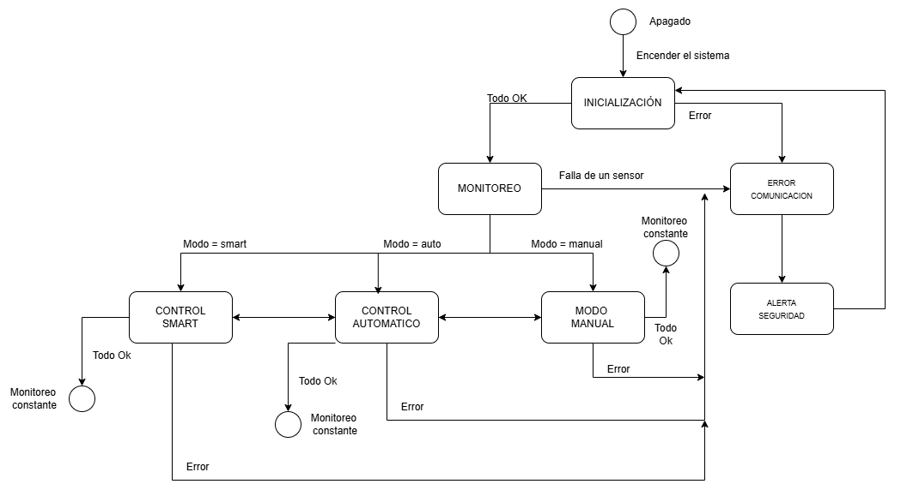
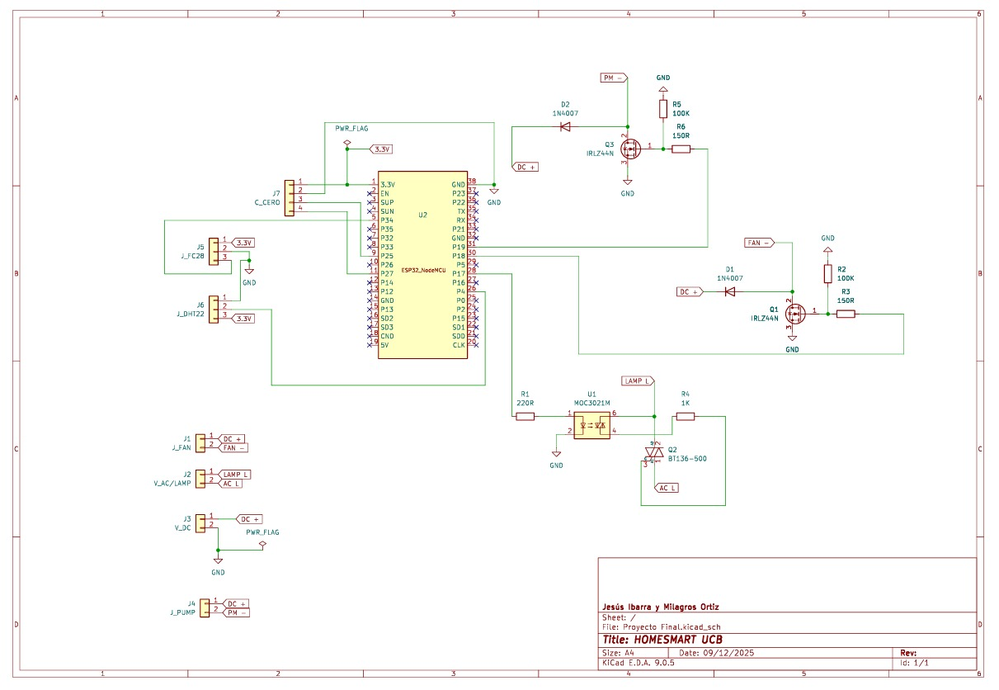
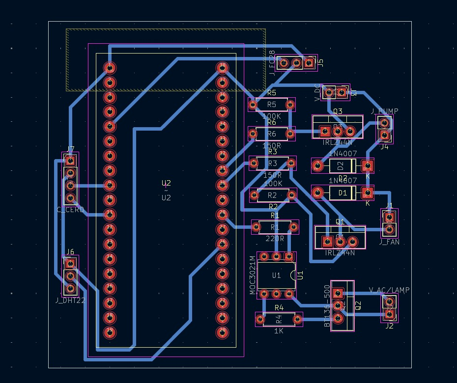

# 🏠 SmartHome UCB – Sistema Domótico Inteligente

## 📌 Descripción Breve
SmartHome UCB es un sistema domótico basado en ESP32 que automatiza procesos dentro de un hogar, integrando sensores ambientales, actuadores y un módulo de inteligencia artificial.  
Permite monitorear clima interior y exterior, controlar automáticamente ventilación y riego, recibir notificaciones y ejecutar acciones mediante comandos de voz.  
El proyecto está diseñado para ser accesible, escalable y adaptable
SmartHome UCB utiliza modelos de Machine Learning para:
- Predecir cuándo estás en casa
- Aprender tus hábitos diarios
- Analizar patrones climáticos
- Tomar decisiones autónomas
- Optimizar el uso de energía y agua
No es solo un sistema automático.
"Es un sistema que aprende contigo."

---

## 🧩 Diagramas del Sistema
Máquina de Estados Finitos:



---
##🪄Diseño de la PCB
Diagrama esquemático del circuito:


Ruteo de la PCB:


---

## 🛠 Tecnologías Utilizadas

### **Hardware**
- ESP32 (microcontrolador principal)
- Sensor BME280 (temperatura, humedad y presión exterior)
- Sensor DHT22 (temperatura y humedad interior)
- Sensor FC-28 (humedad del suelo)
- Relés / Triac con optoacopladores
- Ventilador (12V DC)
- Bomba de agua 12V
- Fuente de alimentación aislada

### **Software**
- **Python 3** (análisis + IA)
- **scikit-learn** (regresiones, clasificación, PCA)
- **pandas / numpy / matplotlib**
- **NLTK** (procesamiento de lenguaje natural)
- **Arduino IDE** (ESP32 firmware)
- **Mosquitto / MQTT**
- **KiCad**

---

## 👥 Integrantes y Roles

| Integrante | Rol |
|-----------|------|
| **Jesús Ibarra** | Diseño del sistema, MQTT, programación ESP32, documentación |
| **Milagros Ortiz** | Modelos ML, entrenamiento de google assistant, documentación |
---

## 🚀 Características principales

- ✅ Control Manual, Automático y Smart
- 🌐 Servidor Web embebido
- 📡 Comunicación MQTT
- 🌡️ Sensores ambientales
- 🌀 Control PWM (velocidad de rotación) del ventilador
- 💾 Almacenamiento de WiFi en NVS
- 🧠 Arquitectura con FreeRTOS
- 📲 Notificaciones externas (Telegram)
- 💡 Circuito y control DIMMER (intensidad de luminosidad) del foco


## 🌐 Acceso a la interfaz web y configuración Wi-Fi

El sistema **SmartUCB** incluye una **interfaz web integrada en la ESP32** que permite:
- Controlar actuadores (foco, bomba, ventilador)
- Ajustar el dimmer y velocidad PWM
- Visualizar sensores
- Configurar la red Wi-Fi del usuario

El comportamiento de red depende de si existen o no credenciales Wi-Fi guardadas en memoria.

---

## 🔌 Arranque inicial (modo Access Point)

Cuando la ESP32 se enciende y **no existen credenciales Wi-Fi almacenadas en la memoria NVS**, el sistema entra automáticamente en **modo Access Point (AP)**.

En este modo:

- La ESP32 crea su propia red Wi-Fi:
  - **SSID:** `SmartHome-Config`
  - **Contraseña:** `12345678`
- No es necesario Internet para acceder a la interfaz
- El servidor web se inicia **siempre**, incluso en modo AP

---

## 📶 Conexión al Access Point

1. En tu celular o computadora, busca redes Wi-Fi disponibles
2. Conéctate a la red: SmartHome-Config
3. Ingresa la contraseña: 12345678

---

## 🖥 Acceso a la interfaz web

Una vez conectado al Access Point:

1. Abre cualquier navegador web
2. Ingresa la dirección IP por defecto del AP: http://192.168.4.1
3. Se cargará el **panel web SmartUCB**, desde donde podrás:
- Encender / apagar actuadores
- Ajustar sliders (foco y ventilador)
- Ver sensores
- Configurar Wi-Fi

---

## 📡 Configuración de la red Wi-Fi personal

En la sección **Configuración Wi-Fi** de la interfaz web:

1. Ingresa:
- **SSID** (nombre de tu red Wi-Fi)
- **Contraseña**
2. Presiona el botón **“Guardar Wi-Fi”**
3. El sistema:
- Guarda las credenciales en memoria NVS
- Muestra un mensaje de confirmación
- Reinicia automáticamente la ESP32

---

## 🔁 Funcionamiento normal (modo Station)

Después del reinicio:

- La ESP32 intenta conectarse a la red Wi-Fi guardada
- Si la conexión es exitosa:
- Se activa el modo **WIFI_STA**
- El Access Point se deshabilita
- La IP es asignada por el router
- La IP local se muestra en el **Monitor Serial**

Ejemplo:
```text
Conectado a WiFi
IP local: 192.168.1.45

Desde cualquier dispositivo conectado a la misma red, accede a:
http://192.168.1.45

## 🧹 Opción: Olvidar credenciales

La interfaz web incluye el botón “Olvidar credenciales”, que cumple la siguiente función:

- Borra el SSID y la contraseña almacenados en memoria NVS

- Fuerza un reinicio de la ESP32

- En el siguiente arranque, el sistema vuelve a modo Access Point

## 📌 Casos de uso recomendados

- Cambio de red Wi-Fi

- Cambio de contraseña

- Fallos de conexión persistentes

- Instalación del sistema en una nueva ubicación

Después de usar esta opción, el proceso de configuración comienza nuevamente desde el modo AP.

---

## 🧠 Notas finales

Este proyecto está pensado como una base **modular y escalable** para sistemas domóticos más complejos, integrando control local, remoto e inteligente en una sola plataforma.

---

✨ *Desarrollado con ESP32 y mucho cariño* ✨